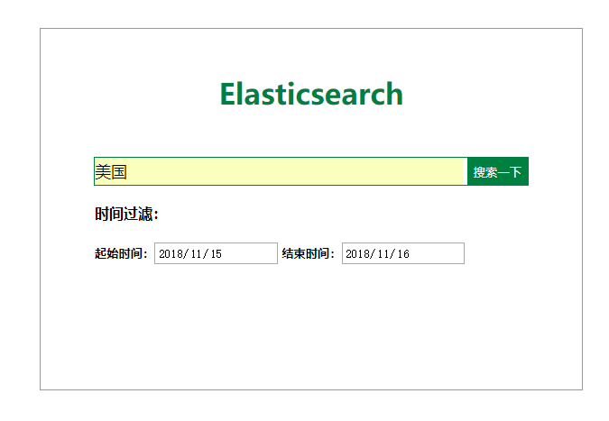
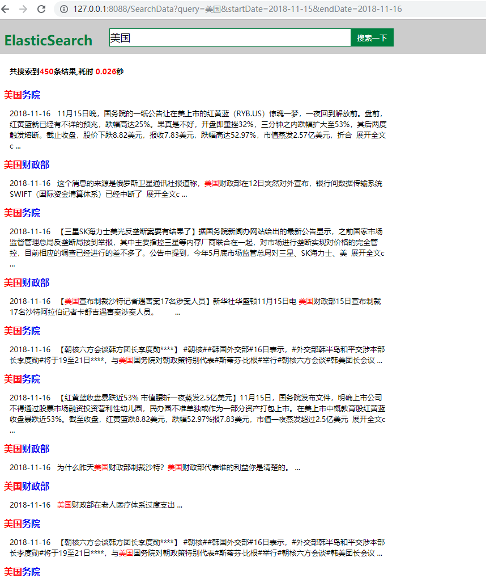

# 1 引言
该程序使用tomcat构建了web项目，用于检索elasticsearch中的数据。
# 2 使用说明
（1）创建client时需要指定集群名称、地址、端口，使用需要对该内容作出调整，类路径为：ntci.elastic.EsUtils; 
（2）查询时需要指定索引名称、类型、字段，详情见ntci.controller.ElasticSearchServlet 
（3）需要构建tomcat环境
# 3 效果展示
## 3.1 查询首页

  

## 3.2 查询结果

  

